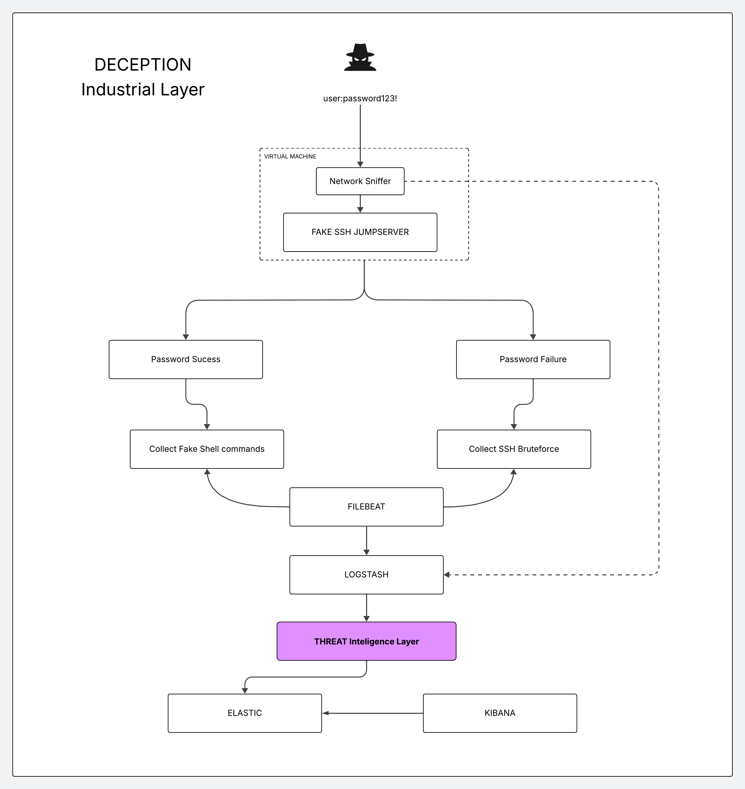

# FakeOT: Proactive Open Architecture for Threat Detection in OT Environments

  <a href="#english">English</a> • 
  <a href="#portugues">Português</a>

---

## 🇺🇸 English Version

This repository contains the **FakeOT** architecture, an open, modular, and scalable solution designed for proactive threat detection in Operational Technology (OT) environments through the deployment of honeypots.

### What is it?
**FakeOT** is a deception framework that integrates digital trap mechanisms, telemetry normalization, and analytical correlation. It was developed to identify adversarial behaviors, protocol-level anomalies, and attack patterns within the contexts of **OT** and **Botnets**.

### Impact
The project addresses critical limitations of current detection solutions for OT/IoT, bridging the gap between academic research and operational security. 

* **Interoperability:** Facilitated integration with SIEM and SOAR platforms.
* **Reproducibility:** Container-based implementation, ensuring scalability and reproducibility.
* **Isolation:** Simulated adversarial interactions in an **ISOLATED** manner, ensuring total isolation from production systems.

### Benefits
* **Early Detection:** Identification of Tactics, Techniques, and Procedures (TTPs) before they reach actual assets.
* **Threat Intelligence:** Generation of structured data to feed Threat Intelligence pipelines.

### Current Status
The project is currently in the **development phase**.
* The architecture is already capable of capturing telemetry and performing structured data ingestion.
* **Current focus:** Analyzing and generating benign behaviors with the aim of learning and creating a baseline for anomaly detection.

### Current Architecture
* **Host Traffic Capture:** Network traffic capture in each honeypot and ingestion into the **Threat Intelligence Layer**.
* **Honeypot JumpServer:** Fake SSH Shell with logs of brute-force attempts. It captures all commands executed in the fake shell, enabling correlation with anomalous traffic.
* **Analysis Pipeline:** Full **ELK Stack** integration for deep observability, ingestion, parsing, and visualization.

  

### Roadmap
* **Real-world Exposure:** Testing in open internet environments to capture data from botnets.
* **Protocol Expansion:** Inclusion of support for **Modbus/TCP**, **DNP3**, and **OPC-UA**.
* **Federated Learning:** Exploration of collaborative model training without sharing sensitive raw data.
* **Open Science:** Publication of sanitized datasets and detection rules for the industrial cybersecurity community.

---

## 🇧🇷 Versão em Português

Este repositório contém a arquitetura **FakeOT**, uma solução aberta, modular e escalável projetada para a detecção proativa de ameaças em ambientes de Tecnologia Operacional (OT) através da implantação de honeypots.

### O que é?
O **FakeOT** é um framework de decepção (deception) que integra mecanismos de armadilhas digitais, normalização de telemetria e correlação analítica. Foi desenvolvido para identificar comportamentos adversários, anomalias de protocolo e padrões de ataque nos contextos de **OT** e **Botnets**.

### Impacto
O projeto aborda as limitações críticas das soluções atuais de detecção para OT/IoT, preenchendo a lacuna entre a pesquisa acadêmica e a segurança operacional.

* **Interoperabilidade:** Integração facilitada com plataformas SIEM e SOAR.
* **Reprodutibilidade:** Implementação baseada em containers, garantindo escalabilidade.
* **Isolamento:** Interações adversárias simuladas de forma **ISOLADA**, garantindo isolamento total dos sistemas de produção.

### Benefícios
* **Detecção Precoce:** Identificação de Táticas, Técnicas e Procedimentos (TTPs) antes que atinjam ativos reais.
* **Inteligência de Ameaças:** Geração de dados estruturados para alimentar pipelines de Threat Intelligence.

### Status Atual
O projeto encontra-se em **fase de desenvolvimento**.
* A arquitetura já é capaz de capturar telemetria e realizar a ingestão estruturada de dados.
* **Foco atual:** Analisar e gerar comportamentos benignos com o intuito de aprender e criar um baseline para detecção de anomalias.

### Arquitetura Atual
* **Host Traffic Capture:** Captura de tráfego de rede em cada honeypot e ingestão na camada de **Threat Intelligence**.
* **Honeypot JumpServer:** Shell SSH falso com logs de tentativas de brute-force. Captura todos os comandos executados na shell fake, permitindo a correlação com tráfego anômalo.
* **Pipeline de Análise:** Integração total com a **Stack ELK** para observabilidade profunda, ingestão, parse e visualização.

### Roadmap (Onde queremos chegar)
* **Exposição Real:** Testes em ambiente de internet aberta para capturar dados de botnets.
* **Expansão de Protocolos:** Inclusão de suporte para **Modbus/TCP**, **DNP3** e **OPC-UA**.
* **Aprendizado Federado:** Exploração de treinamento de modelos colaborativos sem compartilhar dados sensíveis.
* **Open Science:** Publicação de datasets higienizados e regras de detecção para a comunidade de segurança industrial.